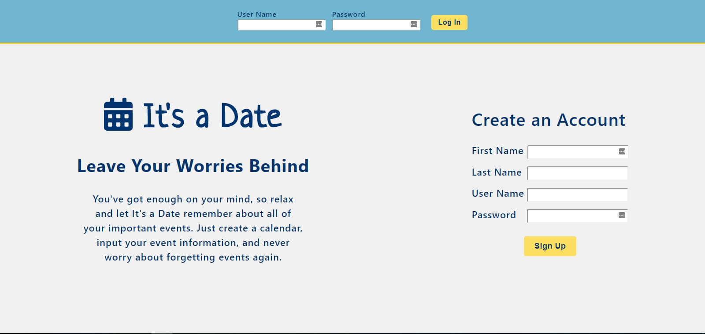
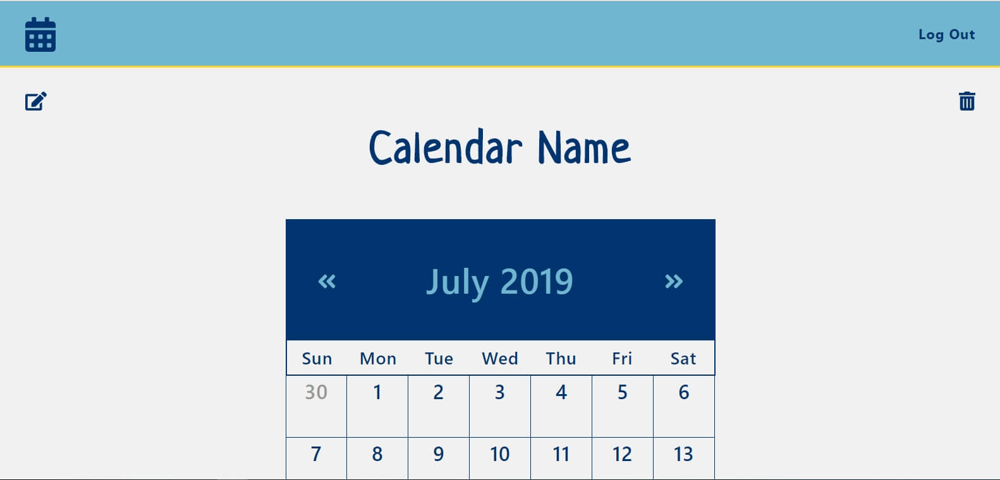
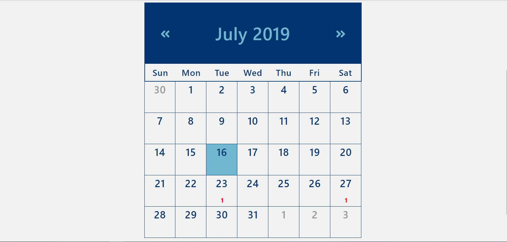
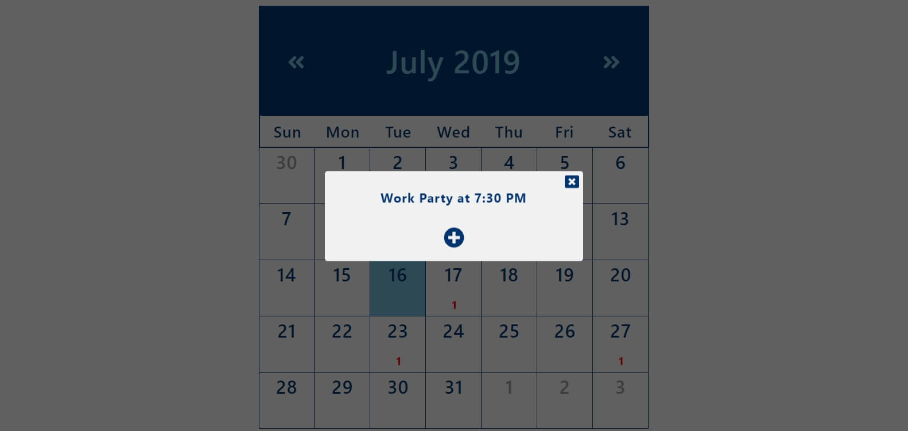
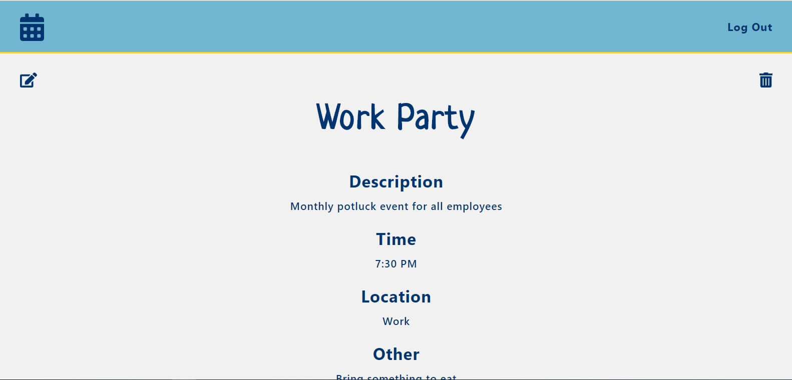

# It's a Date App

## Demo User Credentials
* Username: demoUser2019
* Password: !q2W#e4R

## Live Site:
* https://its-a-date-app.mcelroywes.now.sh/

## Screenshots:

### Landing Page:

### Calendar View:

### Events Modal:

### Event:

## Motivation
I wanted to create a calendar app that combines basic functionality that users would expect from such an app,
along with a unique, fun display.

## Summary
This app allows users to create a password-protected calendar to store their events.
Users create a single calendar (which can be deleted and edited) and can create, view, edit, and delete events.

## Technologies Used
* HTML
* CSS
* JavaScript
* React
* Node
* Express
* PostgreSQL